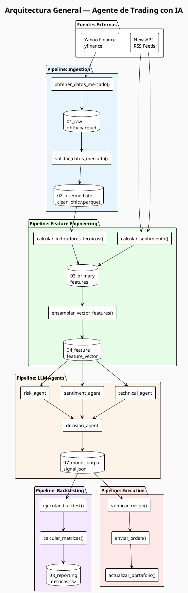
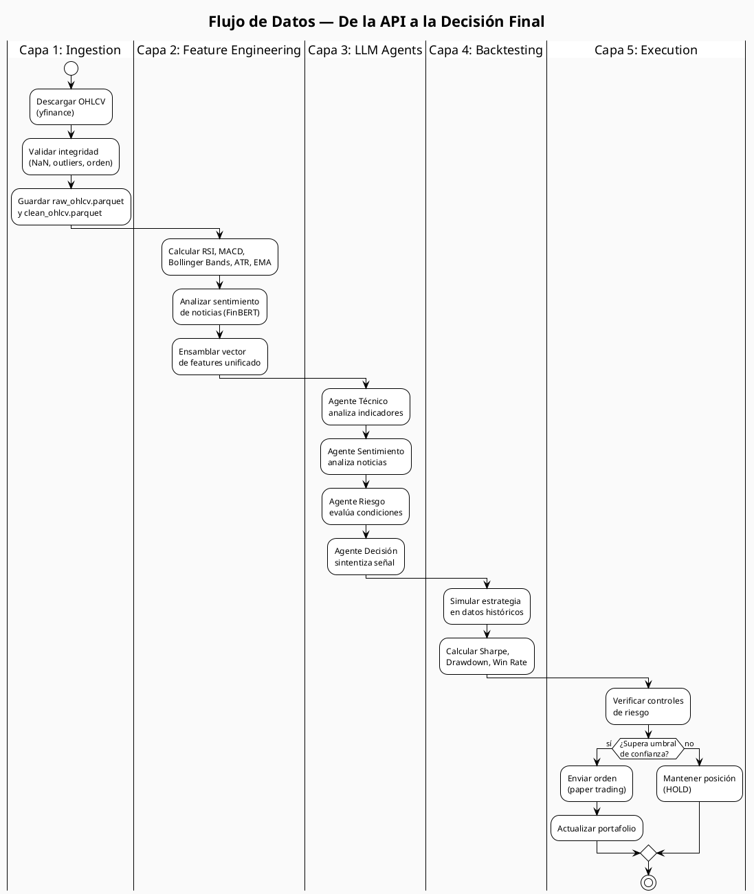
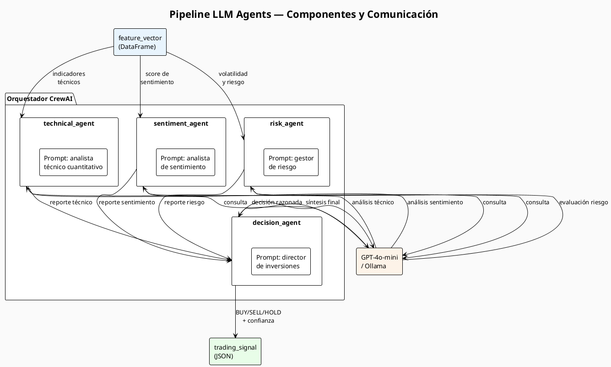
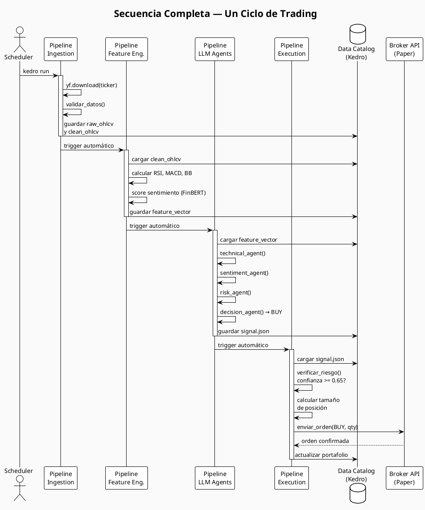
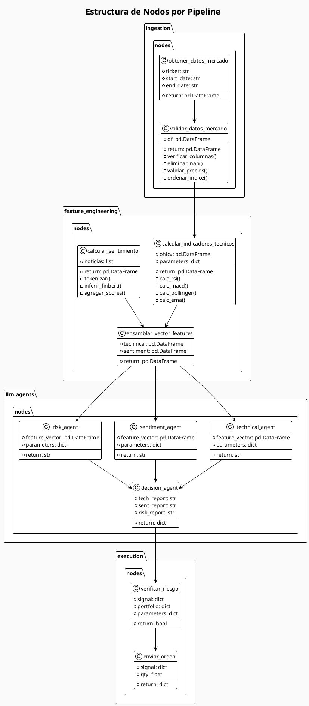
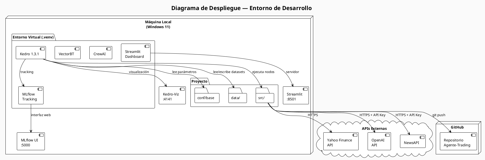

# Diagramas del Sistema — Agente de Trading con IA
> Todos los diagramas están en formato PlantUML. Renderizar en https://www.plantuml.com/plantuml

---

## 1. Diagrama de Arquitectura General



---

## 2. Diagrama de Flujo de Datos



---

## 3. Diagrama de Componentes — Pipeline de Agentes LLM



---

## 4. Diagrama de Secuencia — Ciclo Completo de Trading



---

## 5. Diagrama de Clases — Estructura de Nodos



---

## 6. Diagrama de Despliegue



---

## Cómo Renderizar

**Opción 1 — Online:**
1. Copiar cualquier bloque entre `@startuml` y `@enduml`
2. Pegar en https://www.plantuml.com/plantuml/uml/

**Opción 2 — VS Code:**
```bash
# Instalar extensión: "PlantUML" de jebbs
# Instalar Java (requerido por PlantUML)
# Alt+D para previsualizar
```

**Opción 3 — CLI con UV:**
```bash
uv pip install plantuml
python -m plantuml docs/diagramas/diagramas.md
```
